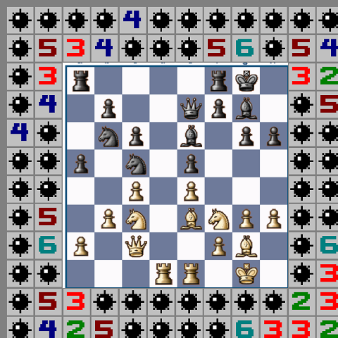

MaterialGirl -- Chess Engine
===========================

MaterialGirl is a chess-engine, developed by Rombelstielzchen from the Schachfeld-forum. Meant to become semi-strong and fun to play. After 20 months of development we now proudly release the first version to the public.

The engine supports the universal-chess-interface for communication with your favourite GUI. It uses a 12x12-board for calculation. The engine -- despite her name -- shows some entrtaining way of playing chess, pretty anti-materialistic. MaterialGirl often sacrifices and happily plays completely unclear positions. Some fun features:
* optimizing material away when mating
* being able to mate with three knights (not yet with bishop and knight however)
* an undie-promoter and endgame-clown are planned in order to bring more funny mates to the board.

[Change-log](docs/developers/change_log.md)

How To Download
---------------
[version_1.0.zip](https://github.com/rombelstielzchen/Schachfeld_Engine/raw/refs/heads/main/release/archives/material_girl_chess_engine_1.0.zip) (Windows, 64 Bit)

[Older versions](release/archives)

How to Use
----------
First download the latest zip-archive and extract it, e.g. to your desktop. Then take your favourite graphical chess-program. There should be a menu-item like Menu -> Engines -> Install Engine..., that either opens a custom dialog or directly starts a file-selection-dialog. Here select *MaterialGirl.exe*. If you get asked if the engine supports the UCI-protocol or the WinBoard-protocol, choose UCI. The engine should be now ready to be used. Some GUIs will automatically start the new engine, others will ask you to start the new one. Have fun!

How To Get The Source-Code
--------------------------
* First you need Git, a source-code management system. As a Windows-user you can get it from [https://git-scm.com/downloads/win](https://git-scm.com/downloads/win).
* Git comes with two frontends: a graphical user-interface and a console, Git-Bash.
  We use the latter one, which works on other systems too. Open Git-Bash, then change the working-directory at the command-prompt:
  ~~~
  cd Desktop
  ~~~
* Now you can check out the project from Github. At your command-prompt type:
~~~
git clone https://github.com/rombelstielzchen/Schachfeld_Engine
~~~
 Once the download has completed you should see **Schachfeld_Engine** at your desktop, 
 This directory contains the complete Git-database (hidden) and the code of the main development-branch. Enjoy!

How To Build
------------
### On Windows ###
* Get [Visual Studio 2022](https://visualstudio.microsoft.com/de/vs/community/) from MicroSoft for free (16.000 diskettes). Install especially the C++ development-tools on the left hand side of the installer.
* Open the file "src/Visual_Studio/material_girl.sln".
* Click Menu -> Build -> Rebuild All.
* The command-line program "material_girl.exe" should now exist in the folder "src/visual_studio/x64/Release", ready to be used.

### On Linuxoid Systems ###
* Make sure you have the following programs installed: basename, bash, echo, git, g++, ld, make, perl, sed, sort, uniq, xargs, zip. Most of them should be installed per default, don't worry.
* Open a DOS-Fensterle and change the directory to "/home/otto/desktop/schachfeld_engine/src" or whatever the username is, my dear Mr. Otto.
* Run the "make" command.
* Enjoy the "engine" program in your working directory.

The makefile currently supports the following commands:
* make: create a debug-build of the engine, then run the internal tests
* make clean
* make exe: build a Windows executable. This command requires Windows, a Linux-like command-line like Git-Bash and Visual Studio.
* make optimized: planned for the future
* make stats: show project statistics
* make todo: show TODO-comments

How To Geek
-----------
If you are curious, how a chess-engine works under the hood, 
you might just double-click the executable for a first impression. 
MaterialGirl will then run user-friendly in a black window
and display some instructions.

How To Communicate / Cooperate
------------------------------
We have a development-thread at the legendary Schachfeld-forum: [Einen Namen f&uuml;r das Baby](https://www.schachfeld.de/threads/40956-einen-namen-fuer-das-baby). The forum is mostly German, but our members speak all languages: Italian, Spanish, French, Scotch, Latvian, Catalan. You are welcome!

MaterialGirl on Rating-Lists
---------------------------------
(coming soon)
* [CCRL](https://computerchess.org.uk/ccrl/4040/)
* [CEGT](http://www.cegt.net/40_40%20Rating%20List/40_40%20SingleVersion/rangliste.html)
* [SSDF](https://ssdf.bosjo.net/list.htm)

License
-------
MaterialGirl is licensed as open-source under GPLv3. This basically means that you are allowed to do whatever you want, as long as you distribute any derived work under the same noble conditions.

* [GPLv3](docs/license_GNU_GPLv3/gpl_v3.html)
* [GPLv3 FAQ](docs/license_GNU_GPLv3/gpl_v3_faq.html)

Thank You!
----------
* David J. Barnes for his excellent tool [pgn-extract](https://www.cs.kent.ac.uk/people/staff/djb/pgn-extract/).
* Fredrik Bornander for his [logging module on CodeProject](https://www.codeproject.com/Articles/63736/Simple-debug-log-for-C)
* The makers of PGN-Mentor for their [huge collection of high-quality games](https://www.pgnmentor.com/files.html).
* ReorX for testing on Mac and reporting problems with the build-process.
* Salto.mattale for asking "Do we test? Do we test? Do we test?" This advice was the very-very-very-best!
* Zadesa for testing and reporting problems.
* The following Schachfeld-members for discussing / voting / laberbacking:  alxms, alwi, Azuriel, black_is_ok, Cardinalem, Danalto, DerSenator, dfuchs, First_Myschkin, Flachspieler, frostengel, Gelegenheitspatzer, hummersimpson, jadubbs, Jake_The_Rat, kawizo, king999, Krennwurzn, Lancelot, LowScore, Matze234, McMiller, NoNoo, PerryOde, problemist, Schach-Bundy, Schaakie, schubix, Syxx, Thrym, Timothy, Trippelbauer, Waldmeister.

Feel welcome to contact us at the Schachfeld-forum if you miss your name on the list.

