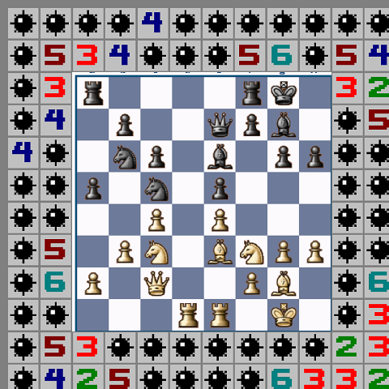

Schachfeld Engine
=================

The Schachfeld-engine is a chess-engine, developped by some members of the Schachfeld-forum. Meant to become semi-strong and fun to play one day. Currently in the early stages of its development.

The engine supports the universal-chess-interface for communication with your favourite GUI. It uses a 12x12-board for calculation and is planned to receive an endgame clown with some funny mating patterns.

How To Download
---------------
Not yet

How to Use
----------
Not yet

How To Get The Source-Code
--------------------------

How To Build
------------
### On Windows ###
* Get [Visual Studio 2022](https://visualstudio.microsoft.com/de/vs/community/) from MicroSoft for free (16.000 diskettes). Install especially the C++ development-tools on the left hand side of the installer.
* Open the file "src/Visual_Studio/Schachfeld_Engine.sln".
* Click Menu -> Build -> Rebuild All.
* The command-line program "schachfeld.exe" should now exist in the folder "src/visual_studio/x64/debug", ready to be used.

### On Linuxoid Systems ###
* Make sure you have the following programs installed: g++, ld, make, perl, sed.
* Open a DOS-Fensterle and change the directory to "/home/otto/desktop(schachfeld_engine/src" or whatever the username is, my dear Mr. Otto.
* Run the "make" command.
* Enjoy the "engine" program in your working directory.

How To Communicate / Cooperate
------------------------------
We have a development-thread at the legendary Schachfeld-forum: [Einen Namen f&uuml;r das Baby](https://www.schachfeld.de/threads/40956-einen-namen-fuer-das-baby). The forum is mostly German, but our members speak all languages: Italian, Spanish, French, Scotch, Latvian, Catalan. You are welcome!

License
-------
The Schachfeld-engine is licensed as open-source under GPLv3. This basically means that you are allowed to do whatever you want, as long as you distribute any derived work under the same noble conditions.

* [GPLv3](docs/license_GNU_GPLv3/gpl_v3.html)
* [GPLv3 FAQ](docs/license_GNU_GPLv3/gpl_v3_faq.html)

Thank You!
----------
* David J. Barnes for his excellent tool [pgn-extract](https://www.cs.kent.ac.uk/people/staff/djb/pgn-extract/).
* iThe makers of PGN-Mentor for their [huge collection of high-quality games](https://www.pgnmentor.com/files.html).
* Fredrik Bornander for his [logging module on CodeProject](https://www.codeproject.com/Articles/63736/Simple-debug-log-for-C)

Feel welcome to contact us at the Schachfeld-forum if you miss your name on the list.

